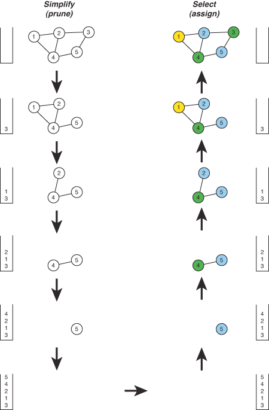

## Chapter 8

## Chapter 9

### Used MIPS Instructions

At the machine language level there are no explic it data types, only contents of memory
locations. The concept of type is present only implicitly in how data is used.

See _MipsCodegen.fs_

**MIPS Addresses**

The MIPS instruction that loads a word into a register is the `lw` instruction. The store
word instruction is `sw`. Each must specify a _register_ and a _memory_ _address_. A MIPS
instruction is 32 bits (always). A MIPS memory address is 32 bits (always). How can a load
or store instruction specify an address that is the same size as itself?

An instruction that refers to memory uses a **base register** and an **offset**. The base
register is a general purpose register that contains a 32-bit address. The offset is a
16-bit signed integer contained in the instruction. _The sum of the address in the base_
_register with the (sign-extended) offset forms the memory address_

**Pseudoinstructions**

In short this instruction is provided by assembler not from processor!

The `addu` instruction, used as above with register `$zero`, copies a bit pattern from the
source register into the destination register. This is usually called a _move operation_,
although the source register does not change. It is often convenient to _move_ a value
from one register to another.

It is awkward to say `add` when you mean `move`. The **extended assembler** allows you to
use the mnemonic `move` instead of `addu`. **This mnemonic does not correspond to a new
machine instruction.** It is just a way of asking for the same instruction by using a more
intuitive mnemonic. It is a pseudoinstruction that the **assembler** translates into the
appropriate **basic** assembly instruction.

_A pseudoinstruction is an instruction that the extended assembler replaces with one or_
_more basic assembly instructions._

```assembly
lw  dset, offset(base)  # offset is optional
```

**Immediate Instruction**

A computer program instruction, part of which contains a constant (**immediate value**)
to be operated upon, rather than the address of that data. Immediate values are typically
used in instructions that load a value or performs an arithmetic or a logical operation
on a constant. Example:

```assembly
add  rd, rs, rt
addi  rt, rs, imm
```

**Notes**
- All integers are in **2’s complement** representation if not indicated as _unsigned_.
- Unsigned values range from `0` to `255` (store larger numbers)
- Signed values range from `-128` to `127`
- In `C` cannot overflow an unsigned integer
- Operand order is fixed - destination first: <opcode>  <destination>, <left operand>, <right operand>
- Can refer to registers by name (e.g., `$s2`, `$t2`)

**Legend**

`rd` - register destination (store result)
`rs` - register that contains first operatnd
`rs` - register for the second operand
`imm` - immediate value

#### Assembly Directives

`.data`  Mark beginning of a data segment.

`.word size`  In `.word` data is stored in the form of 32 bits. It can also
              be used to initialize array.

`.ascii str`  Declare and initialize a string. `.ascii "Hello word"` for example.

`.align 4`    The next variable (symbol) should starts at an address that is a multiple of 4
              Word data must be "word aligned". Word address ends in a number devisible by 4 in MIPS.
              In hex address ends with: 0, 4, 8, c. In binary ends with two zeros `00`.

Computer's processor does not read from and write to memory in byte-sized chunks. Instead, it accesses
memory in _two-, four-, eight- 16-_ or even _32-byte_ chunks. The size in which a processor accesses
memory its **memory access granularity**. For example to allocate 20 words of memory use the following:

```assembly
       .align 2
array: .space 80
```

The `.align` is necessary to guarantee that the array is started on a word boundary.

`.byte n1, n2..` Store the `n` values in successive bytes of memory.
                 Byte (4 Bits) data type is used for single integers without any decimal places.
                 It can also be used to store character.

`.space 128`  Reserve space for a variable (array). Not initialized.

#### Data Movement Instructions

`move  rdest, rsrc`  _pseudoinstruction_

#### Store Instructions

`sw  reg, address`  Store the word from register _reg_ at _address_. See `lw`.
                    `sw  reg, 1000(base)` means _Memory[base+1000]=reg_

#### Jump Instructins

`jal  label`  Unconditionally jump to the instruction at label. Save the address of the next
              instruction in register `$ra`. Use when making procedure call because it saves the
              return address in `$ra`. Here is how you can interpret `jal  1000`:
                 **$ra=PC+4; go to address 1000**

`j  label`  Unconditionally jump to the instruction at label. Go to the `label`(address)

`jr  reg`  Unconditionally jump to the instruction whose address is in register `reg`. Use for switch
           or procedure return (`jr RA` # PC = $ra)

#### Branch Instructions

`bne  rs, rt, label`  Test if registers `rs` and `rt` are **not** equal.
                      `bne  rs, rt, 1000` means _if(rs != rt); go to PC+4+1000_

`blt  rs, rt, label`  (_pseudoinstruction_) Branch on less than.
                      `blt  rs, rt, 1000` means _if(rs < rt); go to PC+4+1000_

`bgt  rs, rt, label`  (_pseudoinstruction_) Branch on greater than.
                      `bgt  rs, rt, 1000` means _if(rs > rt); go to PC+4+1000_

`ble  rs, rt, label`  (_pseudoinstruction_) Branch on less than or equal.
                      `ble  rs, rt, 1000` means _if(rs <= rt); go to PC+4+1000_

`bge  rs, rt, label`  (_pseudoinstruction_) Branch on greater than or equal.
                      `bge  rs, rt, 1000` means _if(rs >= rt); go to PC+4+1000_

Not used in current implementation

`bltu  rs, rt, label`  (_pseudoinstruction_) Branch on less than **unsigned**.

`bleu  rs, rt, label`  (_pseudoinstruction_) Branch on less than or equal **unsigned**.

`bgtu  rs, rt, label`  (_pseudoinstruction_) Branch on greater than **unsigned**.

`bgeu  rs, rt, label`  (_pseudoinstruction_) Branch on greater than or equal **unsigned**.

#### Load Instructions

`lw  rdest, address`  Copy from memory to register. See `sw`.
                      `lw  rdest, 1000(base)` means _rdest = Memory[base+1000]_

`li  rdest, imm`  (_pseudoinstruction_) Move the constant `imm` into register `rdest`.

`la  rdest, address`  (_pseudoinstruction_) Loads computed address of label (not its contents)
                      into register `rdest`.
                      `la  rdest, label` means _rdest = Address of the label_

#### Arithmetic and Logical Instructions

Remember arithmetic operands are registers or immediates, not memory!

`addi  rd, rs, imm`  `addi  rd, rs, 1000` means _rd = rs + 1000_

`add  rd, rs, rt`  means _rd = rs + rt_

`sub  rd, rs, rt`  means _rd = rs - rt_

`mulo  rdest, rsrc1, src2`  (__pseudoinstruction_) Multiplay `rsrc1` with `src2` and store
                            result in `rdest`. Signal overflow.

`div  rs, rt`  (__pseudoinstruction_) Divide register `rs` by register `rt`.
               Leave the quotient in register `lo` and the remainder in register `hi`.
               `hi, lo = rs/rt`.

### Example code

#### Labels

A label may refer to the location of a data value (variable) or of an instruction.

```assembly
       .data
N:     .word 10

       .text

main:
       lw  $t0, N      # $t0 <-- Mem[N] (10)
       la  $t1, N      # $t1 <-- N      (address)
       ...
exit:  li  $v0, 10
```

#### Loop

```C
int Sum = 0;
for (int i = 1; i <= N; ++i) {
    Sum = Sum + i
}
```

```assembly
# $s0 == Sum, $s1 == N, $t0 == i
      move  $s0, $zero     # register assignment
      lw  $s1, N           # assume global symbol
      li  $t0, 1           # literal assignment

loop: beq   $t0, $s1, done   # loop test
      add   $s0, $s0, $t0    # Sum = Sum + i
      addi  $t0, $t0, 1      # ++i
      b     loop             # restart loop
done:
```

#### Arrays

```assembly
      .data
list: .word 2, 3, 5, 7, 11, 13, 17, 19, 23, 29 # ten elements

size: .word 10  # array size (not used but could be)

.....
     la  $t1, list   # get array address
     li  $t2, 0      # set loop counter

print_loop:
            beq  $t2, $t3, print_loop_end   # check for array end
            lw  $a0, ($t1)                  # print value at the array pointer
            li  $v0, 1
            syscall
            addi  $t2, $t2, 1               # advance loop counter
            addi  $t1, $t1, 4               # advance array pointer

            j  print_loop                   # repeat the loop

print_loop_end:
```

#### Procedures

With no parameters

```assembly
get_integer:
             # Prompt the user to enter an integer value. Read and return
             # it.  It takes no parameters.

             li  $v0, 4        # system call code for printing a
                               #    string = 4
             la  $a0, prompt   # address of string is argument 0 to
                               #    print_string
             syscall           # call operating system to perform
                               #   print operation
             li  $v0, 5        # get ready to read in integers
             syscall           # system waits for input, puts the
                               #   value i
```

Call the defined procedure

```assembly
...
        .data      # Data declaration section
prompt: .asciiz "Enter an integer value\n"
        .text

main:                  # Start of code section
      jal get_integer  # Call procedure
      move $s0, $v0    # Put returned value in "save" register
...
```

With 4 parameters

```assembly
proc_example:
              addi  $sp, $sp, -4   # adjust stack pointer to make
                                   #   room for 1 item
              sw  $s0, 0($sp)      # save the value that was in
                                   #   $s0 when the call occurred
              add  $t0, $a0, $a1   # $t0 = g + h
              add  $t1, $a2, $a3   # $t1 = i + j
              sub  $s0, $t0, $t1   # $s0 = (g + h) - (i + j)
              move  $v0, $s0       # put return value into $v0
              lw  $s0, 0($sp)      # restore value of $s0
              addi  $sp, $sp, 4    # restore the stack pointer
              jr  $ra              # jump back to the
                                   #    return addres
```

Call with parameters

```assembly
...
      move  $a0, $s0     # position the parameters
      move  $a1, $s1
      move  $a2, $s2
      move  $a3, $s3

      jal  proc_example  # make the call
      move  $a0, $v0     # return value will be in $v0
      li  $v0, 1         # system call code for print_int
      syscall            # print it
...
```

### Online symulator

http://www.kvakil.me/venus/

## Chapter 11

### Register allocation

  _Graph coloring_ is a relatively simple method which can be used for some of the scheduling
problems, e.g.  for **register allocation**.  To apply graph-coloring to register allocation,
we frst need to construct an _interference graph_, as discussed in the last chapter.  Next,
we color the interference graph using `K` different colors, where `K` is the number of
registers available for allocation. _No pair of nodes which are connected by an edge may be_
_assigned the same color._
  If it is impossible to color the interference graph with the given `K` colors, then we
will have to keep some of the values (represented by corresponding vertices) in the memo-
ry (for at least part of their lifetime).  The compiler should generate the code such that
a live value will either reside in a register or in a memory location.  Before the program
overwrites a register which stores a still-live value, that value must be saved to a
memory location.  This is called **spilling** the register, and the memory location to save
the spilled value called its _spill location_.

#### Coloring by Simplication

For arbitrary graphs, coloring is an NP-complete problem.  On the other hand, there exists
a linear-time heuristic method (known since 19th century) which is based on simplication
of the graph described as follows:

- Until the graph is empty, and a vertex, a, whose degree is < `K`. Remove a from the graph
and push it to the coloring stack. (Some people propose that the node with the _lowest_
degree is removed.)

- If such a vertex cannot be found before the graph becomes empty, then the simplication
fails.

- Otherwise, the graph can be colored in `K` colors by sequentially coloring the vertices
popped off the coloring stack. The reason the last step mentioned above works is because:

_For any vertex m whose degree is < K, if the graph G-{m} can be colored in K colors, then_
_so can G._

  If the simplication scheme fails, it does not mean that a `K-coloring` does not exist.
An "optimistic" scheme continues to remove a vertex from the graph and push it into the
colo ring stack. (Which vertex to remove depends on how we define the spilling priority.)
During the coloring phase, we might still find it possible to color the graph with K-colors.
  If the optimistic scheme still fails, it still does not mean that a `K-coloring` does
not exist.  However, to simplify the solution, we will just assume that a `K-coloring`
does not exist and we resort to spilling.
  Any vertex that cannot be successfully colored is put in the _spilling list_.  We continue
to color the rest of the vertices (just to see if there exist more spilled vertices).  When
this is done, we need to modify the code by inserting memory load and store instructions for
the spilled values.
  The spilling code inserted above introduces more temporaries with short live ranges. We
re-draw the interference graph and re-apply the coloring scheme. We iterate until we can
color the modifed graph with `K` colors.



#### The Spilling Cost

When choosing a vertex in the interference graph to spill, the compiler needs to compare
the spilling priority among the possible candidates. Such a priority depends on the
spilling cost and the degree of the vertex in the graph. Commonly, the vertex with the
_lowest value_ of

```
 spilling cost
---------------
    degree
```

is considered the best candidate for spilling.

  A vertex with a _high degree_ in the interference graph is considered to be a good
candidate for spilling because its spilling may yield a better chance for the remaining
vertices to be colorable.
  The spilling cost of a vertex is the performance penalty paid at run time due to the
decision to spill the corresponding variable to the memory. _Generally speaking, the more_
_often a variable is referenced at run time, the higher its spilling cost._

#### Pre-colored nodes

Register-allocation schemes discussed above assume that all hardware registers can be used
in the same way.  However, as discussed in Chapter 6, different registers can be assigned
different roles in order to make function call/return faster:

- A number of registers may be designated to pass function arguments.
- One or two registers may be used to return function value(s).
- A subset of the registers may be designated as saved by the caller and the rest
designated as saved by the callee.

In order to use all registers as fully as possible, in order to reduce memory references,
we want almost all registers be eligible for register allocation, (with a few such as **FP**,
**SP** and **return-address register** excluded).

On the other hand, we need to retain the special roles of different registers. To do this,
we add all registers (which participate in register allocation) to the interference graph
and add appropriate edges to reflect the special constraints. These vertices are called
_pre-colored._

- At the entry of the function, the registers which are used to pass arguments should be
copied to the formal arguments. These registers are dead after the copying is done, until
some of these registers are used to return function result(s).

- All callee-save registers are copied to new temporaries.  These registers then remain
dead until the new temporaries are copied back to them at the exit of the function. The
live range of those new temporaries, therefore, expand nearly the whole function.

- Any `CALL` instruction is assumed to define all callersave registers. Therefore, a
variable `x` which is not live across any `CALL` will not interfere with any callsave
registers. However, if `x` is live across a `CALL`, then it interferes with all caller-save
registers. On the other hand, `x` will also interfere with all those new temporaries which
are copied from callee-save registers, causing one of those temporaries to spill (because
their spill priority is highest). This will cause `x` to be allocated to a callee-save
register.

- It is meaningless to select any pre-colored vertex to spill, so we assign the lowest
spilling priority to precolored vertices.

In the discussion above, register copying is introduced in many places. It is quite
possible that some of them are unnecessary. A technique called **coalescing** can be used to
eliminate unnecessary copying. Since this technique is very specialized and there are
other compiler techniques which can achieve the same or better effect.
