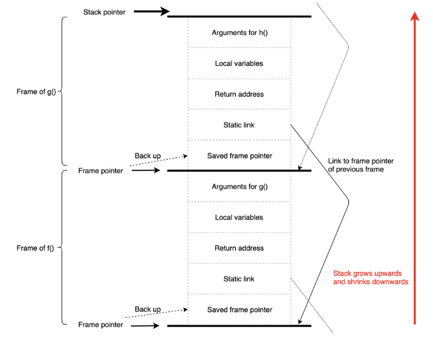
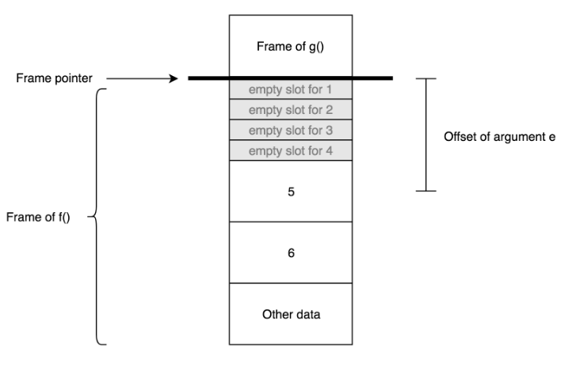

## Activation Records

The execution process of a program involves different types of memory
allocations: stack allocation, register allocation, heap allocation.

### Stack Frames

During the execution process of a program, each time a function is called,
a chunk of memory is reversed by the computer for savingexecution data such as
local _variables_, _return address_ of that function. This piece of data is often
known as function's **frame** or **record**. Once the function returns, its
data frame is automatically de-allocated.

### Frame Layout

In general, the stack frame of a function is used to store local variables,
function’s argu-ments and return addresses. The frames of all function calls
usually share the common layout. This is a convention that is used by
compiler/hardware producers.

To understand the framelayout of a function call, there are several concepts
that need to be explored: stack pointer, frame pointer, return address, local
variables, arguments of function calls, and static link.



#### Stack Pointer

Stack pointer (SP) is a pointer that always point at the top of the frame stack.
When a function `f()` is called, the size of the stack grows by the same volume as
the frame’s size of function `f()`. This is to ensure that the frame can
sufficiently store necessary data of function `f()`. Therefore, each
time a function `f()` is called, the stack pointer must be recalculated following
the formula: `SP = SP + <frame’s size of function f()>`

Similarly, the size of the stack frame declines by the same amount when
function `f()` returns. Any data stored by the program at addresses beyond the
stack pointer is treated as garbage data which needs to be collected.

Cares about the whole process of function execution. Grows until function
(and possible all contained in it) return result.

#### Frame Pointer

Stack pointer always points to the top of the stack, which means that the stack
pointer addressmight increase as the size of the stack grows. As a result,
accessing local variable using offset from the stack pointer can become tricky,
confusing and error-prone. For example, a variable `X` was allocated at
the offset `-8` from the stack pointer at one point in the process. However, when
the stack pointer address increases by the size of `4`, the exact same variable `X` has
to be accessed at the offset `-12` from the stack pointer. Therefore, several
assembly implementations leverage **frame** pointer to easily access frame-allocated
variables. Cares about current function execution. Kind of local pointer.

Frame pointer (FP) is a pointer that points to the start of the active frame on
the stack. Hence, the frame pointer address does not change during the time the
frame of function `f()` is active.

In the implementation using the frame pointer, when the function `f()` calls
function `g()`, the current location of the frame pointer is saved to the stack
frame of function `f()`. Next, the frame pointer points to the same location as
the stack pointer before the stack pointer address is increased by the size of
frame `g()`. In order to access variable `X` allocated on the frame of function
`g()` when the its frame is active, the program adds the offset of variable `X`
to the current frame pointer address and uses this calculated address to load
`X`. When the function `g()` exits, the stack pointer points to the same
location as the frame pointer. Next, the previously saved frame pointer address
is loaded from the frame back to the current frame pointer. Therefore, the
locations of frame pointer and stack pointer are restored as they were before
the function `g()` was called.

#### Return Address

The return address of a function call is the location in the program where the
execution continues right after that function call has returned. For instance,
when function `f()` calls function `g()`, the call to function `g()` assigns the
location of the next instruction in the body of `f()` to the current return
address. Therefore, the previous return address has to be saved in the frame of
function `f()` before it is changed. Once the function `g()` has return, the
program jumps back to the return address of the function `g()`, which is a
location in the body of function `f()`, and continue executing the following
instruction. Finally, the previously back-up return address of function `f()` is
restored.

#### Static Links

Tiger supports nested function declarations. This means that if a function `g()` is
defined in the body of function `f()`, function `g()` can have access to
variables previously declared in the scope of function `f()`.

```
let function f() =
  let
    var a := 5
    function g(): int = a
    function h() = g() + a
  in
    h()
  end
in
  f()
end
```

In this program, function `g()` and function `h()` are declared nested in the body of
function `f()` after the declaration of variable `a`. As a result, function `g()` and
`h()` can access variable `a`. However, Tiger does not provide support for function
closure mechanism which allows function to be treated as first-class object, to be
passed around or to be returned like any other values. Therefore, a function in
Tiger can only be called within its scope.

In order to support nested function declarations, the frame pointer of function
`f()` is passed as the first argument to the every nested function call `g()` and
`h()`. The passed frame pointer is often refereed to as **static link.**

Interestingly, when function `g()` is called within the body of function `h()`, the
program must pass the frame pointer of function `f()` instead of the frame pointer
of function `h()`! This is because function `g()` is declared inside the body of
function `f()` rather than the body of function `h()`. At this point, the frame of
function `h()` is active;thus, the program uses the static link value saved in the
frame of `h()` to obtain the frame pointer address of its parent function. Luckily,
the function `f()` is the shared parent function of both function `h()` and function
`g()`. As a result, the frame pointer address of function `f()` is passed as the first
argument to the function call of `g()`. However, there are cases where parent
function of function `h()` is not the direct parent of function `g()`. In those cases,
the program repeats the process of following static links until it reaches the
frame of the parent of function `g()`.

#### Local Variables

Short-lived local variables of a function are preferably stored in processor's
registers for quick access. Typically, those variables are the ones that are not
accessed by any nested functions (un-escaped variables) or they do not out-live
the frame of the functions that they are directly declared within.

However,there exists exceptional cases where short-lived, un-escaped
variables are saved to the stack frame. One such example is when the size of
a variable exceeds the capacity of a single register; thus, it has to be saved into
stack-frame instead. In addition, if the number of local variables exceeds the
number of available registers, some variables have to be spilled in the frame.

In order to access the frame-resident variable `x` located at the offset
`X` from the frame pointer, the compiler calculates the address of `x` by adding the
offset `X` to the frame pointer address and uses the calculated result to load `x`. If
a frame-allocated variable is accessed within nested functions, the program
follows the static-link until it reaches the frame pointer address of function `f()`
where `x` is declared and load variable `x` using offset `X`.

#### Function Arguments

There are many conventions defininghow argument values are passed into a
function when that function is called. One such convention is MIPS function call
standard which is demonstrated by examining the program in:

```
let
  function f() = g(1, 2, 3, 4, 5, 6)
  function g(a: int, b: int, c: int, d: int, e: int, f: int): int = a + b + c + d + e + f
in
  f()
end
```

In this example, function `g()` is invoked in the body of function `f()`. Hence,
function `f()` is refered to as a **caller** while function `g()` is refered to as a
**callee**. When function `f()` calls functions `g()`, the first 4 arguments `a`, `b`, `c`, `d` of
the function `g()` are passed via registers while the rest (`e`, `f`)are saved at the end
of the caller function `f()`'s frame. Stack frame when function `g()` is called:



Despite the fact that the values for the first 4 arguments of `g()` are passed via
registers, function `f()` still reserves 4 empty slots in its frame for those
arguments in case function `g()` needs to save those values!!

Additionally, function `f()` saves the values 5, 6 for arguments `e`, `f` in its frame.
Those frame-allocated arguments `e`, `f` can be accessed inside function
`g()` by subtracting the frame pointer address with arguments' offsets.

#### Heap Allocation

Obviously, frame-resident variables are allocated on the entry of the function and
de-allocated when that function returns. As a result, the program can not save
variables such as array or record in the stack frame as they might outlive the
frame of the function that they are defined in. For example, given the program:

```
let
  type arr = array of int
  function create_array(): arr = array [5] of 1
  var out_live_array := create_array()
in
  out_live_array[0]
end
```

In this program, the array, created in the body of function `create_array()`, has
to be returned and used after the frame of that function is removed from the
stack. Therefore, this array can **not** be allocated in stack frame of function
`create_array()`.

In practice, Tiger **arrays** and **records** are allocated in heap which
is a part of computer's memory that might require manual memory management from
programmers or automatic memory management by garbage collectors. In C
programming language, native functions such as `malloc()` and `calloc()` can be
called to allocate data to the heap while function `free()` can be used to
de-allocate obsolete heap-allocated memories. If obsolete heap memory is
not efficiently released, the program may run into memory leak problem.
