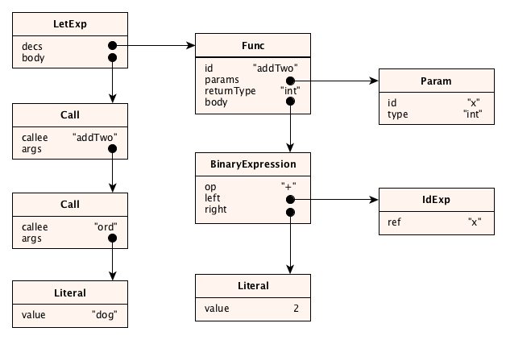
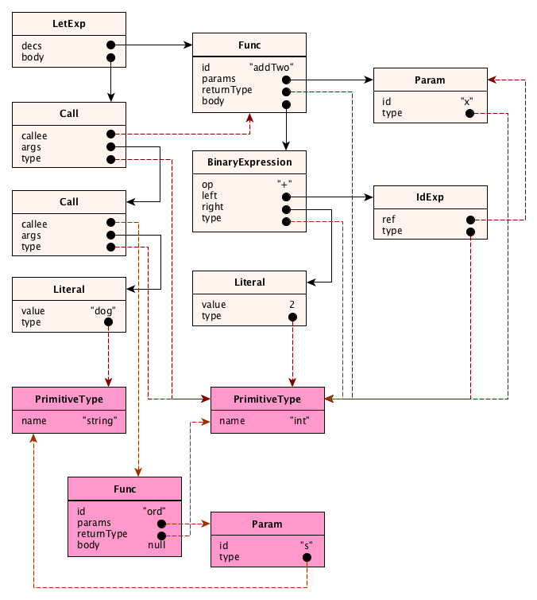

## Syntax only

## Understanding Semantic Analysis

As you know, it’s very possible that your program has no _syntax errors_, but is
still _semantically meaningless_. In a **static** language like Tiger, the semantic
checking phase of the compiler is huge! The following are just _some_ of the rules
required:

- Identifiers must be **in scope** before they are used.

Identifiers for the built-in types `int` and `string`, and all the built in functions,
are assumed to be pre-declared in a scope that encloses the entire program.

- Identifiers must not be declared _more than once_ in a scope.

- All fields in a record type must be unique within the type declaration.

- In a variable declaration, the type of the initializer(RHS) must be compatible with
  the declared type of the variable, if a declared type exists. (If there is no
  declared type, it’s fine, the variable gets declared with the inferred type of
  the initializing expression.)

- In an assignment, the type of the source must be compatible with the type of the target.

- In a call (or _operator invocation_!), the number of arguments must match the number of
  parameters in the callee.

- In a call (or operator invocation), the types of the arguments must be compatible with
  the types of the corresponding parameters.

- The order, names, and types of bindings in a record expression must match the
  fields of the corresponding record type exactly. By match we mean the order
  and names are **exactly** the same, and the types of the record expression
  arguments must be compatible with the declared types of the fields.

- The types of the `then` and `else` parts of an `if-then-else-expression` must be the same.

- The types of the `then` part of an `if-then-expression` must be the `void` type.

- A `break` expression may only appear within a `for` or `while` expression; however,
  watch out for function declarations inside of loops.

- Any cycle of recursive types must pass through at least one record type.

All of these checks must be made following the **scope rules** of the language, summarized here as:

- The scope of a variable begins at its declaration and runs to the end of the _block_ in which it is declared.

- The scope of a type or function is the entire block in which it is declared
  (necessary to allow for recursive functions and recursive types).

- The scope of a record field is the body of the record type and any record expression of that type.

Also we have to compute the **types** of every expression. There are rules for that too:

- The type of an integer literal is `int`; the type of a string literal is
  `string`; the type of nil is the special `Nil` type.

- The type of an identifier expression referring to a variable is the type of the variable.

- The type of array, record, subscript, and member expressions should be
  obvious. See language specification for the details.

- Type type of a `for`, `while`, assignment or `break` expression is `void`
  which is a way of saying the expression doesn’t really have a type.

- The type of an `if-then expression` is `void`; the type of an `if-then-else`
  expression is the type of the bodies (which must match).

- The type of a `let` expression or expression sequence is `void` if the body or sequence
  is empty, otherwise it is _the type of the last expression_ (return value).

- The type of a call expression is the return type of the function being called (which might be void).

Semantic analysis proceeds by traversing the AST and performing actions at each
node. These actions include: entering declarations into a **context object** for
easy lookup later; resolving identifer references to the declarations they refer
to; computing the type of an expression; performing legality checks.

### What a semantic analyzer does?

- Create nodes for the built-in functions and types
- Add a type field for all expressions
- Resolve all identifier references to point to the actual variable, function, or type nodes
- Apply all semantic checks defined by the language.

Final result should be:

- In the AST, the properties representing identifiers for variables, functions,
  and types were **resolved** to be _references_ to the actual nodes for the
  variables, functions, and types.

**In other words, in the AST they were identifiers, but after semantic analysis they turned into node references!**

- Expression nodes got a new property, called `type`. This makes type checking much easier!

- New nodes were added, where necessary, for the built-in types and standard functions.

## Testing strategies

To get 100% test coverage, we should make sure that all _grammar rules_ appear
somewhere in the test script. Also the parser itself should throw an exception
if the parse fails. We don’t have to test all types of syntax errors here: we
already did so in the grammar test! We just need one line in our test that says
that the parser will throw an exception if there is a syntax error. Note that
our test programs may have **semantic errors**.
